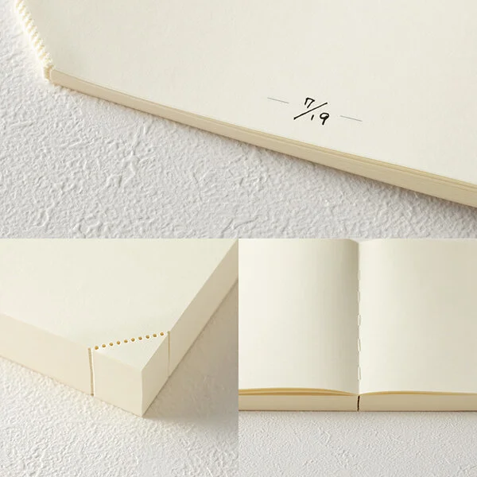
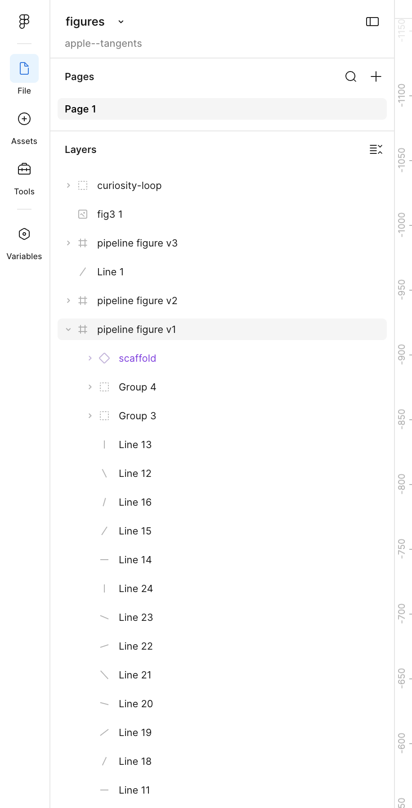
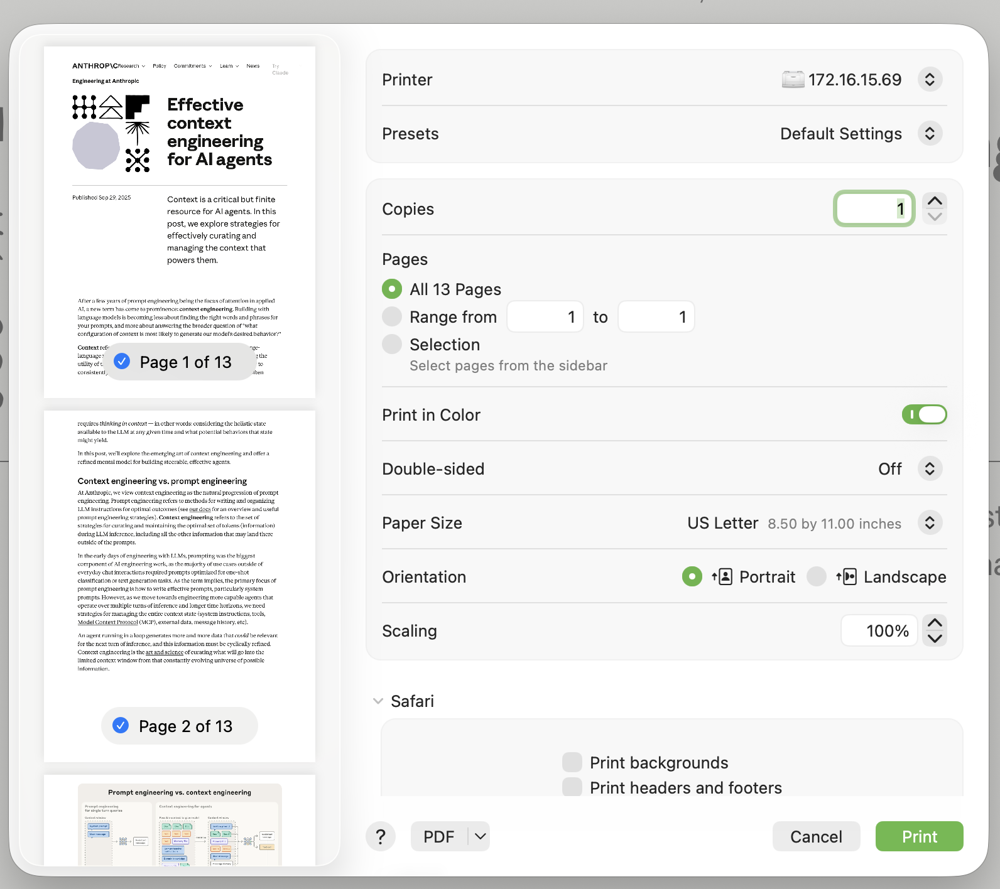

# design

My-tldraw is a polished, well-thought out canvas extension for obsidian. 
I'm trying to combine:
- the intuitive, well-thought out design of a piece of Apple software
- the playful, sketchy feel of tldraw
- some of the affordances and functionality of Figma (though not all, since we want to have it still be a sketching tool not a full design tool)

It should feel like it was designed by Apple, and should have a fun, playful quality.

## paper look and feel

The background should look like md paper

## outline tree view

Figma provides a tree view of the scene to complement the canvas view.
I'd also like to provide a similar affordance.

Key features:
- "collapse all"
- locking an object, show/hide
- arrow keys to navigate
- shift+click and cmd+click to select multiple
- space to rename
- same right-click menu as if I had right clicked on the object in the cavas

## importing a PDF

take inspiration from the apple print dialog for importing PDFs

- include thumbnails I can click on to turn pages on/off
- include a radio button like the 'pages' section that lets you choose all, range, selection. also include a free-form import that i can type pages and ranges into as a fourth radio button.
